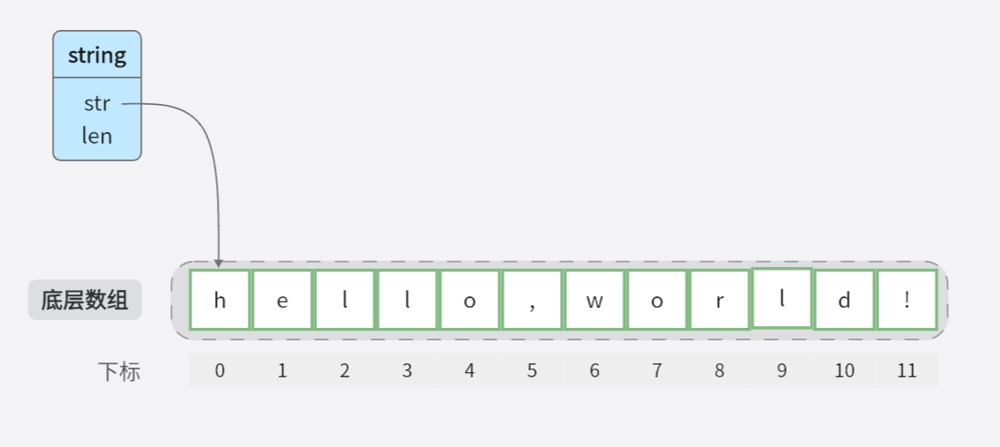
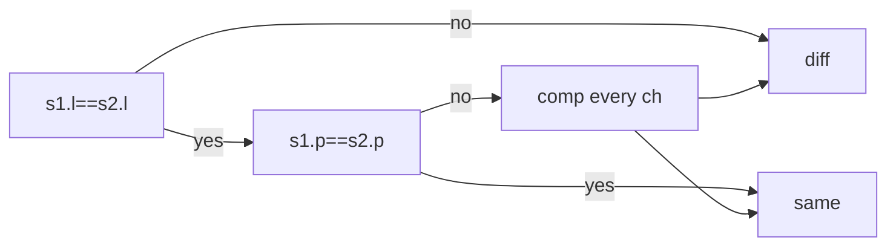

<!--more-->

> go version is go1.20.4

## 一、字符串的结构

查看 string 在运行时的结构：

```go
type stringStruct struct {
	str unsafe.Pointer
	len int
}
```

这个结构体具有两个字段：

1. `str`：一个指向字符串数据的指针，使用`unsafe.Pointer`类型来表示。`unsafe.Pointer`是Golang中的特殊类型，可以存储任意类型的指针，但需要谨慎使用，因为它可以绕过类型系统的安全检查。
2. `len`：一个整数，表示字符串的长度。

???tip "提示"
    需要注意的是，`stringStruct`结构体在Golang的`runtime`包中是非导出的，即只能在包内部使用。这是为了保护字符串的不可变性和内部结构的稳定性。

    一般情况下，开发者不需要直接操作`stringStruct`结构体，而是使用Golang提供的字符串相关函数和方法来处理字符串。

<figure markdown>
  { width="500" }
  <figcaption>string 与底层字符序列的关系</figcaption>
</figure>

## 二、基本使用探究

### 2.1 声明、初始化

```go
package main

import (
	"fmt"
)

func main() {
	s := "hello"
	fmt.Println(s)
}
```

通过 `dlv` 调试看看底层是如何创建这个 s 变量的：

```text hl_lines="6 11 18 28" linenums="1"
...
     7: func main() {
=>   8:         s := "hello"
     9:         fmt.Println(s)
    10: }
(dlv) disass
        ...
=>      main.go:8       0x679c92*       4881ec08010000                  sub rsp, 0x108
        main.go:8       0x679c99        4889ac2400010000                mov qword ptr [rsp+0x100], rbp
        ...
        main.go:10      0x679ce0        e8db11f6ff                      call $runtime.convTstring                                                                                                       
        main.go:10      0x679ce5        4889442428                      mov qword ptr [rsp+0x28], rax
(dlv) b runtime.convTstring                                  
Command failed: Breakpoint exists at C:/Go/go1.20.4/src/runtime/iface.go:388 at 5daec6
(dlv) c
> runtime.convTstring() c:/go/go1.20.4/src/runtime/iface.go:388 (hits goroutine(1):1 total:1) (PC: 0x5daec6)
    ...
=> 388: func convTstring(val string) (x unsafe.Pointer) {
   389:         if val == "" {
   390:                 x = unsafe.Pointer(&zeroVal[0])
   391:         } else {
   392:                 x = mallocgc(unsafe.Sizeof(val), stringType, true)
   393:                 *(*string)(x) = val
   ...
   875: // Allocate an object of size bytes.
   876: // Small objects are allocated from the per-P cache's free lists.
   877: // Large objects (> 32 kB) are allocated straight from the heap.
   878: func mallocgc(size uintptr, typ *_type, needzero bool) unsafe.Pointer {
=> 879:         if gcphase == _GCmarktermination {
   880:                 throw("mallocgc called with gcphase == _GCmarktermination")
   881:         }
   882:
   883:         if size == 0 {
   884:                 return unsafe.Pointer(&zerobase)
(dlv) args
size = 16
typ = (*runtime._type)(0x682140)
needzero = true
~r1 = unsafe.Pointer(0x10)
...
     7: func main() {
     8:         s := "hello"
     9:         fmt.Println(s)
=>  10: }
(dlv) print s
"hello"
```

???note "string 的尺寸是 16"
    在64位的机器上，unsafe.Pointer类型占用8字节，int类型占用8字节，因此结构体的总大小为16字节

???note "mallocgc 方法如何决定开辟的内存是在堆还是栈上"
    在Golang中，当需要分配内存以存储对象时，会根据对象的大小采取不同的分配方式。具体来说：

    - 对于小对象（小于等于32 kB），内存分配会从每个P（处理器）的缓存中的空闲列表中分配。每个处理器都有自己的缓存，其中包含了一系列不同大小的空闲内存块。这种缓存机制可以提高小对象的分配效率，避免频繁地向堆申请内存。
    - 对于大对象（大于32 kB），内存分配会直接从堆（heap）中分配。堆是一个动态分配的内存区域，用于存储较大的对象和数据结构。

    通过这种分配策略，Golang可以在小对象的情况下快速分配内存，而对于较大的对象，直接从堆中分配能够更有效地利用内存空间。

### 2.2 基本操作

#### 拼接

```go
package main

import (
	"bytes"
	"fmt"
	"strings"
)

func main() {
	// 使用加号进行字符串拼接
	str1 := "Hello"
	str2 := "World"
	result := str1 + " " + str2
	fmt.Println(result)

	// 使用 fmt.Sprintf 进行字符串拼接
	result = fmt.Sprintf("%s %s", str1, str2)
	fmt.Println(result)

	// 使用 strings.Join 进行字符串拼接
	strList := []string{str1, str2}
	result = strings.Join(strList, " ")
	fmt.Println(result)

	// 使用 bytes.Buffer 进行字符串拼接
	var buffer bytes.Buffer
	buffer.WriteString(str1)
	buffer.WriteString(" ")
	buffer.WriteString(str2)
	result = buffer.String()
	fmt.Println(result)

	// 使用 strings.Builder 进行字符串拼接
	var builder strings.Builder
	builder.WriteString(str1)
	builder.WriteString(" ")
	builder.WriteString(str2)
	result = builder.String()
	fmt.Println(result)
}
```

上述几种字符串拼接方式的优点和缺点：

| 方法                          | 优点                                                         | 缺点                                             |
|-------------------------------|--------------------------------------------------------------|--------------------------------------------------|
| 使用加号 `+`                  | - 简单直观的语法<br>- 可以直接拼接多个字符串                    | - 性能较差，每次拼接都会创建新的字符串对象         |
| 使用 `fmt.Sprintf`           | - 可以使用格式化字符串进行灵活的拼接<br>- 支持多种数据类型        | - 相对较慢，需要进行格式化字符串的解析和处理       |
| 使用 `strings.Join`           | - 高效的字符串拼接方式<br>- 适用于拼接字符串切片                | - 需要将字符串元素转换为切片，并使用分隔符拼接     |
| 使用 `bytes.Buffer`           | - 高效的字符串拼接方式<br>- 可以连续追加字符串                  | - 需要额外的内存分配，适用于大量的字符串拼接操作   |
| 使用 `strings.Builder`        | - 高效的字符串拼接方式<br>- 可以连续追加字符串                  | - 需要使用额外的 `strings.Builder` 对象            |

每种方法都有自己的优点和缺点，具体使用哪种方式取决于你的需求和性能要求。一般来说，对于简单的字符串拼接，使用加号 `+` 或 `fmt.Sprintf` 是方便快捷的选择。对于大量的字符串拼接操作或需要高性能的场景，可以考虑使用 `bytes.Buffer` 或 `strings.Builder`。如果要拼接字符串切片或可变数量的字符串参数，可以使用 `strings.Join`。

#### 转换

1. `string` 与 `[]byte` 的转换

    ```go
    func conv() {
        s := "hello"
        s2Bs := []byte(s)
        bs2S := string(s2Bs)
    }
    ```

2. `string` 与 `[]rune` 的转换

    与 1. 相同

3. `[]rune` 与 `[]byte` 的转换


    这两者之间是不能直接转换的，可以使用 `unicode/utf8` 库函数来实现这些转换

    ```go
    func Runes2Bytes(rs []rune) []byte {
        n := 0
        for _, r := range rs {
            n += utf8.RuneLen(r)
        }
        n, bs := 0, make([]byte, n)
        for _, r := range rs {
            n += utf8.EncodeRune(bs[n:], r)
        }
        return bs
    }
    ```

???tip "go 编译器针对一些情况做了优化"

    `for-range` 中将 `string` 转成 `[]byte` 是不需要做深拷贝的

    ```go
    func main() {
        var str = "world"
        for i, b := range []byte(str) {
            //...
        }
    }
    ```

    以下两种从 `[]byte` 到 `string` 的情况也是不需要深拷贝的

    ```go
    func fc() {
        // 下面的四个转换都不需要深复制。
        // 一个（至少有一个被衔接的字符串值为非空字符串常量的）字符串衔接表达式中的从字节切片到字符串的转换不需要深拷贝
        if string(x) != string(y) {
            s = (" " + string(x) + string(y))[1:]
        }
    }


    func fd() {
        // 两个在比较表达式中的转换不需要深复制，
        // 但两个字符串衔接中的转换仍需要深复制。
        // 请注意此字符串衔接和fc中的衔接的差别。
        if string(x) != string(y) {
            s = string(x) + string(y)
        }
    }
    ```

???tip "string 的一个语法糖"

    ```go
    hello := []byte("Hello ")
    world := "world!"

    // helloWorld := append(hello, []byte(world)...) // 正常的语法
    helloWorld := append(hello, world...)            // 语法糖
    ```

#### 比较

两个字符串通常使用 `==` 进行比较，比较的时间复杂度取决于 `持有的指针` 是否相同，如果相同，时间复杂度为 `O(1)`，如果不同，时间复杂度为 `O(n)`



### 2.3 遍历

```go
func main() {
	s := "hi, 你好!"
	for i := 0; i < len(s); i++ {
		fmt.Printf("%c", s[i]) // byte
	}
	fmt.Println()

	for _, v := range s {
		fmt.Printf("%c", v) // rune
	}
}
```
输出：
```text
hi, 你好!
hi, 你好!
```
