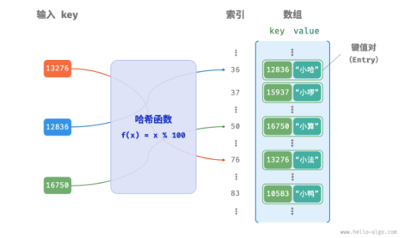
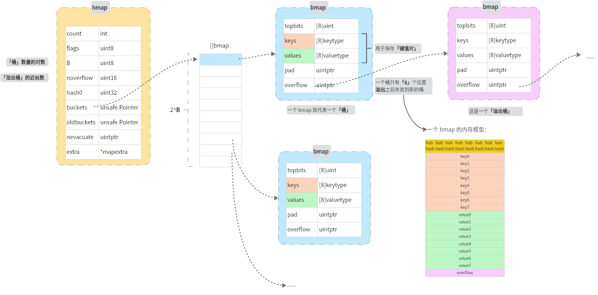
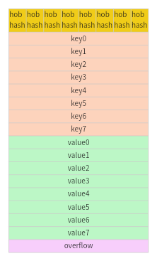
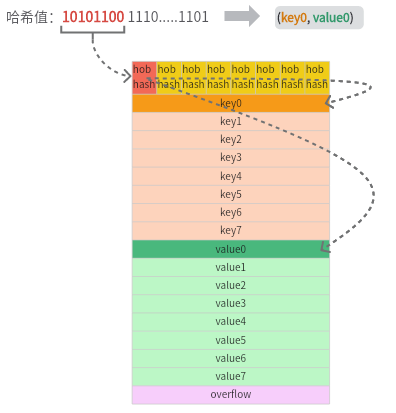

<!--more-->

## 一、对哈希表的回顾

一种最简单的情况，是使用数组来实现哈希表：

  


**`哈希冲突`** 的产生：多个 key 经过哈希函数之后的结果相同

哈希冲突如何解决：
- **`扩大容量`**
- **`优化哈希表的表示来缓解哈希冲突`**
	- 链式地址
	- 开放寻址

**`负载因子`**：[`元素数量`]/[`桶数量`]，通常用负载因子来描述哈希表中冲突产生的严重程度

### 冲突解决 - 链式地址

当冲突发生，即不同的 key 被映射到同一个值，将 **`单个元素转变成链表`**，发生冲突的元素都被放在这个链表中。<font color=grey>跟开放寻址的方式比较，链式地址引入新的数据结构，每个元素除了要保存 (key, value) 键值对，还需要 **保存指向下一个节点的指针，增加了空间开销** </font>

> 相当于图的邻接表实现

  

|操作|描述|
|-|-|
|查询|计算哈希函数结果得到索引，再遍历链表寻找元素|
|增加|计算哈希函数结果得到索引，添加到链表头节点|
|删除|计算哈希函数结果得到索引，再遍历链表删除元素|

可以发现在得到索引后都会有一个遍历链表的操作，可以通过优化链表的表现形式，来减少操作的时间，比如：将链表转化成 **平衡二叉搜索树** 或者 **红黑树**

### 冲突解决 - 开放寻址

开放寻址**不引入额外数据结构，通过「`多次探测`」来解决冲突**

探测的方式通常有：
- 线性探测
- 平方探测
- 多次哈希

|探测方式|冲突产生时步骤|缺点|
|-|-|-|
|线性探测|从冲突位置向后遍历（步长通常为 1），知道找到空位| `伪删除`、`元素聚集` |
|多次哈希|如果第一个哈希函数结果冲突，尝试使用第二个哈希函数来计算，直到不冲突|`额外计算`|

## 二、Golang 如何实现 map

go 语言中，解决冲突采用`链式地址`的方式，规定每个桶最多存储 `8` 个键值对，超出容量则链接一个`溢出桶`，当溢出桶过多，执行一次特殊的`等量扩容`，当 map 的装载因子 > 6.5，执行一次 2 倍容量的扩容

### 2.1 hmap 和 bmap
这是包含 hmap 和 bmap 的一个抽象模型图：

  


hmap 结构体：
```go
type hmap struct {
	count     int
	flags     uint8
	B         uint8
	noverflow uint16
	hash0     uint32

	buckets    unsafe.Pointer
	oldbuckets unsafe.Pointer
	nevacuate  uintptr

	extra *mapextra
}

type mapextra struct {
	overflow    *[]*bmap
	oldoverflow *[]*bmap
	nextOverflow *bmap
}
```

  

上图中 hmap.buckets 指向的是一个 bmap 的列表，大小为 2^B


一个桶 bmap 的结构体：
```go
type bmap struct {
	tophash [bucketCnt]uint8
}
```
在编译期间，会产生一个新的 bmap 结构：
```go
type bmap struct {
    topbits  [8]uint8
    keys     [8]keytype
    values   [8]valuetype
    pad      uintptr
    overflow uintptr
}
```

  

假设当有 9 个元素被放到同一个桶，会创建一个新的「溢出桶」，用来存放溢出的元素。

看一下 bmap 具体是如何保存键值对的，这是一个 bmap 的内存模型图：

  

hob hash 指的是 top hash，也就是哈希值的「高 8 位」，同时 key 与 value 的存放是分别连续的，而不是 key-value-key-value... 的形式，为的是避免字节对齐带来的内存浪费，假设一个哈希值高 8 位对应的是桶的第一个位置，那么它保存的元素应该是：

  


### 2.2 哈希函数 与 key 的定位

// todo 哈希函数的 选择

在经过哈希函数处理后得到的哈希值有 64 bit（在 64 位的机器上），假设下面是一个哈希值

  


其中最低的 B 位用来确定在`哪个桶`，高 8 位用来确定在`桶的哪个位置`。上面这个例子中，B 为 5，map 中有 2^5 = 32 个 bucket，01010 代表的二进制数为 10，也就说明这个 key 应该落在 10 号桶，当元素找到属于的桶之后，会从前往后遍历桶的八个位置，找到一个空的位置就放入，如果不存在空位置，那么就按同样的方法在 overflow 中寻找。


> 相比于传统的哈希表采用的链地址法来解决哈希冲突，go map 的实现也采用到了这个方法，传统的链地址法中，每个节点保存的是一个元素，每个节点都需要一个额外的内存来保存下一个节点的指针，造成了不少的空间开销，go 采用了`短数组+链表`的形式，相当于每个节点保存的是一个桶，每个桶中可以保存 8 个元素，但与链地址法不同的是，Go 中是不会让这个链表变得太长的，具体涉及到 map 的扩容机制。


## 三、map 的扩容
### 3.1 为什么要扩容？
对于啊哈希表来说，冲突是不可避免的，当产生的冲突越来越多的时候，map 的各种性能都会下降
- 举一种极端**情况1**：每次计算的哈希值都相同的情况下，那么每次都会被放入同一个桶中，桶的 8 个空位占满之后，往后链接溢出桶，依次类推，这种情况下，查找、修改操作的时间复杂度都会退化成 O(n)
- 另外一种**情况2**：假设每个桶都已经放满了元素，那么之后往 map 中添加数据都会产生冲突，也就慢慢往情况1的场景上靠近了。

对于 go 的 map 来说，比较理想的情况应该是每个桶值存放一个数据，但是这显然是不可能的，这会造成很多的空间浪费。

### 3.2 什么时候会发生扩容？
为了描述 map 保存元素的情况，引入了一个`装载因子(= [元素数量]/[桶的数量])`的概念，当这个装载因子超过 6.5 (golang) 的时候就会触发 map 的扩容。从装载因子的计算公式可以看出，装载因子没有办法识别到上面的情况1，只能避免情况2，因此还需要另外的一个触发条件来避免情况1

在 map 的 [mapassign](https://github.com/golang/go/blob/f90b4cd6554f4f20280aa5229cf42650ed47221d/src/runtime/map.go#L579) 方法中，判断是否需要扩容：
```go
if !h.growing() && (overLoadFactor(h.count+1, h.B) || tooManyOverflowBuckets(h.noverflow, h.B)) {  
   hashGrow(t, h)  
   goto again // Growing the table invalidates everything, so try again  
}
```
**条件1 - 判断负载因子是否 > 6.5** ：
```go
func overLoadFactor(count int, B uint8) bool {  
   return count > bucketCnt && uintptr(count) > loadFactorNum*(bucketShift(B)/loadFactorDen)  
}
```
**条件2 - 溢出桶的数量大于等于桶的数量**：
```go
func tooManyOverflowBuckets(noverflow uint16, B uint8) bool {  
   if B > 15 {  
      B = 15  
   }  
   return noverflow >= uint16(1)<<(B&15)  
}
```
- 当 B 大于 15 将 B 置为 15 的原因是支持的 map 的最大容量为 2^15
- `noverflow >= uint16(1)<<(B&15)` 相当于 `noverflow >= 1<<B`，也就是当「溢出桶数量」>=「桶数量」的时候，进行扩容操作。`uint16(1)<<(B&15)` 只是为了让编译器生成更短的代码，提高程序执行的效率，没有产生语义上的变化

### 3.3 扩容的过程

当 map 扩容之后，为了避免一次性的大规模的拷贝，map 的扩容是一个`渐进式的过程`，每次只拷贝一个桶（以及它关联的溢出桶），这个拷贝的过程是发生在增加、修改、删除操作的时候

#### [hashGrow](https://github.com/golang/go/blob/f90b4cd6554f4f20280aa5229cf42650ed47221d/src/runtime/map.go#L1058)方法 - 「buckets 扩容」
```go
func hashGrow(t *maptype, h *hmap) {
	// If we've hit the load factor, get bigger.
	// Otherwise, there are too many overflow buckets,
	// so keep the same number of buckets and "grow" laterally.
	bigger := uint8(1)
	if !overLoadFactor(h.count+1, h.B) {
		bigger = 0
		h.flags |= sameSizeGrow
	}
	oldbuckets := h.buckets
	newbuckets, nextOverflow := makeBucketArray(t, h.B+bigger, nil)

	flags := h.flags &^ (iterator | oldIterator)
	if h.flags&iterator != 0 {
		flags |= oldIterator
	}
	// commit the grow (atomic wrt gc)
	h.B += bigger
	h.flags = flags
	h.oldbuckets = oldbuckets
	h.buckets = newbuckets
	h.nevacuate = 0
	h.noverflow = 0

	if h.extra != nil && h.extra.overflow != nil {
		// Promote current overflow buckets to the old generation.
		if h.extra.oldoverflow != nil {
			throw("oldoverflow is not nil")
		}
		h.extra.oldoverflow = h.extra.overflow
		h.extra.overflow = nil
	}
	if nextOverflow != nil {
		if h.extra == nil {
			h.extra = new(mapextra)
		}
		h.extra.nextOverflow = nextOverflow
	}

	// the actual copying of the hash table data is done incrementally
	// by growWork() and evacuate().
}
```

##### 片段解读1
```go 
bigger := uint8(1)
if !overLoadFactor(h.count+1, h.B) {  
  bigger = 0  
  h.flags |= sameSizeGrow  
}  
oldbuckets := h.buckets  
newbuckets, nextOverflow := makeBucketArray(t, h.B+bigger, nil)  
```
这段代码主要是判断是由哪种方式引起的扩容，如果是因为装载因子过大导致的扩容，则新 buckets 的容量为原来的两倍，也就是将 bigger 设置为 1，如果是因为溢出桶过多导致的扩容，则新 buckets 的容量与原来的容量相同

|原因|map容量|
|-|-|
|装载因子>6.5|原来的容量 `x2`|
|溢出桶过多|`=` 原来的容量|


##### 片段解读2
```go
oldbuckets := h.buckets  
newbuckets, nextOverflow := makeBucketArray(t, h.B+bigger, nil)  
  
flags := h.flags &^ (iterator | oldIterator)  
if h.flags&iterator != 0 {  
   flags |= oldIterator  
}
```
这里是创建新桶数组的部分。首先将旧桶数组保存到 `oldbuckets` 变量中，然后调用 `makeBucketArray` 函数创建新的桶数组。如果需要扩容，则新桶数组的大小为原来的两倍；否则，新桶数组的大小与旧桶数组相同。`makeBucketArray` 函数还会返回一个溢出桶数组，如果有的话。

接下来，代码根据当前 map 的标志位来更新新 map 的标志位。如果当前 map 正在被迭代，则将新 map 的标志位设置为 `oldIterator`；否则，将其清除

##### 片段解读3
```go
// commit the grow (atomic wrt gc)
h.B += bigger
h.flags = flags
h.oldbuckets = oldbuckets
h.buckets = newbuckets
h.nevacuate = 0
h.noverflow = 0
```

这里是提交扩容操作的部分。首先将 map 的大小增加 `bigger`（即扩容或横向扩展后的大小），然后更新标志位、旧桶数组和新桶数组。同时，将 `nevacuate` 和 `noverflow` 两个计数器清零，表示没有需要迁移的元素和溢出桶

##### 片段解读4
```go
if h.extra != nil && h.extra.overflow != nil {  
   // Promote current overflow buckets to the old generation.  
   if h.extra.oldoverflow != nil {  
      throw("oldoverflow is not nil")  
   }  
   h.extra.oldoverflow = h.extra.overflow  
   h.extra.overflow = nil  
}  
if nextOverflow != nil {  
   if h.extra == nil {  
      h.extra = new(mapextra)  
   }  
   h.extra.nextOverflow = nextOverflow  
}
```

这里是处理溢出桶的部分。如果当前 map 中存在溢出桶，则将其提升到旧桶数组中。如果新桶数组中也存在溢出桶，则将其保存到 `extra` 字段中

#### [evacuate](https://github.com/golang/go/blob/f90b4cd6554f4f20280aa5229cf42650ed47221d/src/runtime/map.go#L1169)方法 - 「数据迁移」
##### 片段解读1
```go
b := (*bmap)(add(h.oldbuckets, oldbucket*uintptr(t.bucketsize)))  
newbit := h.noldbuckets()  
if !evacuated(b) {
```
获得旧 bucket，判断这个 bucket 是否需要进行迁移（是否迁移完成）
##### 片段解读2
```go
if !evacuated(b) {
	// TODO: reuse overflow buckets instead of using new ones, if there
	// is no iterator using the old buckets.  (If !oldIterator.)

	// xy contains the x and y (low and high) evacuation destinations.
	var xy [2]evacDst
	x := &xy[0]
	x.b = (*bmap)(add(h.buckets, oldbucket*uintptr(t.bucketsize)))
	x.k = add(unsafe.Pointer(x.b), dataOffset)
	x.e = add(x.k, bucketCnt*uintptr(t.keysize))

	if !h.sameSizeGrow() {
		// Only calculate y pointers if we're growing bigger.
		// Otherwise GC can see bad pointers.
		y := &xy[1]
		y.b = (*bmap)(add(h.buckets, (oldbucket+newbit)*uintptr(t.bucketsize)))
		y.k = add(unsafe.Pointer(y.b), dataOffset)
		y.e = add(y.k, bucketCnt*uintptr(t.keysize))
	}
	...
}
```
这段代码的作用是为哈希表进行扩容时，计算出旧桶中键值对需要迁移到的新桶的位置。具体来说：

- 首先定义了一个长度为2的数组xy，用于存储两个疏散目的地（evacDst）。
- 然后通过指针x指向xy[0]，并将其b字段设置为旧桶中第oldbucket个桶的地址，k字段设置为该桶中数据区域的起始地址，e字段设置为该桶中数据区域的结束地址。
- 如果哈希表不是同等大小的扩容，则还需要计算第二个疏散目的地y的位置。此时通过指针y指向xy[1]，并将其b、k、e字段分别设置为新桶中第(oldbucket+newbit)个桶的地址、该桶中数据区域的起始地址和结束地址。

	> 当发生的是两倍容量扩容的时候，原先一个桶中的元素会**裂变**到两个桶中，因为原先使用低 B 位来判断映射到哪个桶，现在需要根据低 B+1 位来判断映射到哪个桶，因此当第 B+1 位为 0 的时候，桶的相对位置与原先的桶是一样的，当第 B+1 位为 1 时，就需要放到两外一个桶中

总之，这段代码的作用是为哈希表扩容时计算出旧桶中键值对需要迁移到的新桶的位置，并将这些位置信息存储在xy数组中。

##### 片段解读3
```go
for ; b != nil; b = b.overflow(t) {
	k := add(unsafe.Pointer(b), dataOffset)
	e := add(k, bucketCnt*uintptr(t.keysize))
	for i := 0; i < bucketCnt; i, k, e = i+1, add(k, uintptr(t.keysize)), add(e, uintptr(t.elemsize)) {
		top := b.tophash[i]
		if isEmpty(top) {
			b.tophash[i] = evacuatedEmpty
			continue
		}
		if top < minTopHash {
			throw("bad map state")
		}
		k2 := k
		if t.indirectkey() {
			k2 = *((*unsafe.Pointer)(k2))
		}
		var useY uint8
		if !h.sameSizeGrow() {
			// Compute hash to make our evacuation decision (whether we need
			// to send this key/elem to bucket x or bucket y).
			hash := t.hasher(k2, uintptr(h.hash0))
			if h.flags&iterator != 0 && !t.reflexivekey() && !t.key.equal(k2, k2) {
				// If key != key (NaNs), then the hash could be (and probably
				// will be) entirely different from the old hash. Moreover,
				// it isn't reproducible. Reproducibility is required in the
				// presence of iterators, as our evacuation decision must
				// match whatever decision the iterator made.
				// Fortunately, we have the freedom to send these keys either
				// way. Also, tophash is meaningless for these kinds of keys.
				// We let the low bit of tophash drive the evacuation decision.
				// We recompute a new random tophash for the next level so
				// these keys will get evenly distributed across all buckets
				// after multiple grows.
				useY = top & 1
				top = tophash(hash)
			} else {
				if hash&newbit != 0 {
					useY = 1
				}
			}
		}

		if evacuatedX+1 != evacuatedY || evacuatedX^1 != evacuatedY {
			throw("bad evacuatedN")
		}

		b.tophash[i] = evacuatedX + useY // evacuatedX + 1 == evacuatedY
		dst := &xy[useY]                 // evacuation destination

		if dst.i == bucketCnt {
			dst.b = h.newoverflow(t, dst.b)
			dst.i = 0
			dst.k = add(unsafe.Pointer(dst.b), dataOffset)
			dst.e = add(dst.k, bucketCnt*uintptr(t.keysize))
		}
		dst.b.tophash[dst.i&(bucketCnt-1)] = top // mask dst.i as an optimization, to avoid a bounds check
		if t.indirectkey() {
			*(*unsafe.Pointer)(dst.k) = k2 // copy pointer
		} else {
			typedmemmove(t.key, dst.k, k) // copy elem
		}
		if t.indirectelem() {
			*(*unsafe.Pointer)(dst.e) = *(*unsafe.Pointer)(e)
		} else {
			typedmemmove(t.elem, dst.e, e)
		}
		dst.i++
		// These updates might push these pointers past the end of the
		// key or elem arrays.  That's ok, as we have the overflow pointer
		// at the end of the bucket to protect against pointing past the
		// end of the bucket.
		dst.k = add(dst.k, uintptr(t.keysize))
		dst.e = add(dst.e, uintptr(t.elemsize))
	}
}
```
该代码中的循环遍历了当前哈希表中所有的桶（bucket），并将其中的元素重新分配到新的哈希表中。具体来说，对于每个桶，它的 tophash 数组中存储了该桶中每个元素的哈希值的前 8 位，如果某个元素的 tophash 值为 evacuatedEmpty，则表示该元素已经被迁移到新的哈希表中；如果 tophash 值小于 minTopHash，则表示哈希表状态错误。

对于每个非空元素，首先根据其键的哈希值计算出它应该被迁移到新哈希表的哪个桶中。如果新哈希表的大小和旧哈希表相同，则直接将元素复制到新哈希表中对应的桶中；否则，需要根据元素的哈希值判断它应该被迁移到新哈希表的哪个桶中。如果元素的键是 NaN，则使用 tophash 的最低位来决定它的迁移目标，以保证多次扩容后仍能均匀地分布在所有桶中。

在将元素迁移到新哈希表的过程中，需要将元素的键和值复制到新的桶中，并更新 tophash 数组。如果元素的键或值是指针类型，则需要使用 unsafe.Pointer 进行转换。同时，还需要记录已经被迁移的元素数量，以便在迁移完成后清空旧哈希表中的元素。

最后，如果旧哈希表中存在溢出桶（overflow bucket），则需要将它们与主桶分离，并清空其中的键和值，以便垃圾回收器回收这些内存。

##### 片段解读4

```go
// Unlink the overflow buckets & clear key/elem to help GC.  
if h.flags&oldIterator == 0 && t.bucket.ptrdata != 0 {  
   b := add(h.oldbuckets, oldbucket*uintptr(t.bucketsize))  
   // Preserve b.tophash because the evacuation  
   // state is maintained there.   
   ptr := add(b, dataOffset)  
   n := uintptr(t.bucketsize) - dataOffset  
   memclrHasPointers(ptr, n)  
}
```
在上述代码中，首先判断当前是否处于旧哈希表的迭代状态（oldIterator），如果不是，则执行以下操作：

1. 获取旧哈希表中的桶（b）。
2. 将溢出桶与键值对解除链接，即将其指针清空。
3. 清空键和值的内容，以便于垃圾回收。

这些操作的目的是为了减少旧哈希表中的内存占用，并且帮助垃圾回收器识别哪些对象可以被回收。在迁移完成后，旧哈希表会被释放掉，这样就可以释放旧哈希表中的所有内存

##### 片段解读5
```go
if oldbucket == h.nevacuate {  
   advanceEvacuationMark(h, t, newbit)  
}
```

todo

### 两种扩容方式

|原因|map容量|
|-|-|
|装载因子>6.5|原来的容量 `x2`|
|溢出桶过多|`=` 原来的容量|


---
1. [6.1.   哈希表 - Hello 算法](https://www.hello-algo.com/chapter_hashing/hash_map/)
2. [由浅到深，入门Go语言Map实现原理 - TIGERB的技术博客 - SegmentFault 思否](https://segmentfault.com/a/1190000039101378)
3. [Go面试题(三)：map的实现原理_map是基于什么实现的_我是小道哥的博客-CSDN博客](https://blog.csdn.net/xiaodaoge_it/article/details/121297144)
